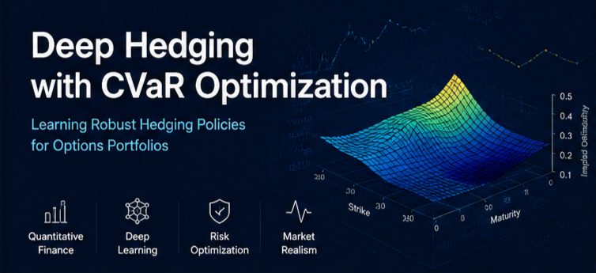
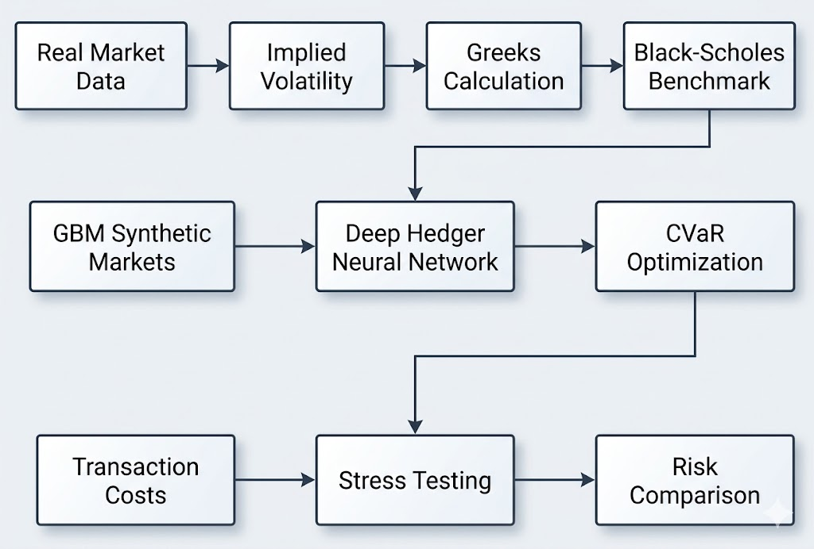
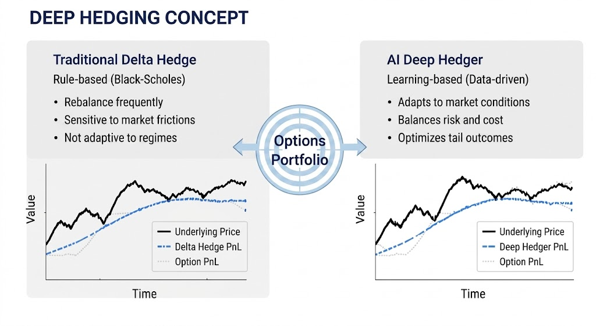
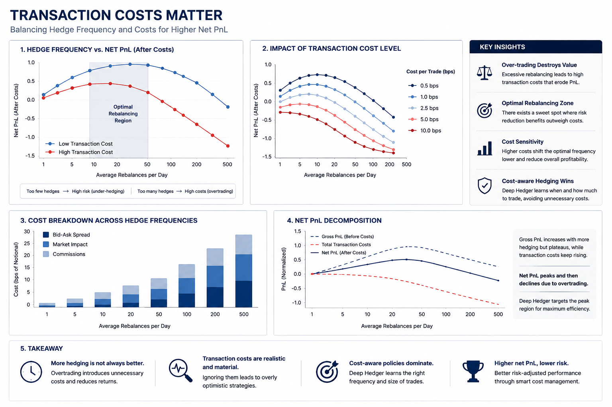
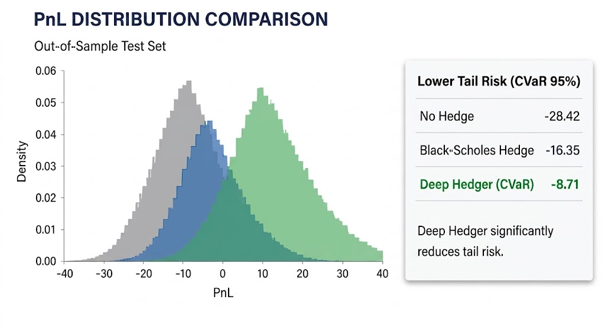
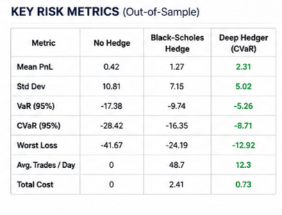
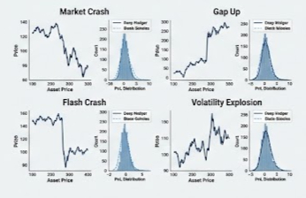
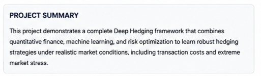

# Deep Hedging with CVaR Optimization

<p align="center">
  
</p>

<p align="center">
  <b>Learning Robust Hedging Policies for Options Portfolios using Deep Learning and Risk-Aware Optimization</b>
</p>

---

## Overview

Traditional option hedging relies on Black-Scholes Delta Hedging.

While effective under ideal assumptions, real markets contain:

- Transaction Costs
- Market Crashes
- Flash Crashes
- Gap Events
- Volatility Regime Changes
- Tail Risk

This project explores whether a Deep Hedger can learn hedge positions that outperform traditional delta hedging under realistic market conditions.

The objective is **not to predict stock prices**.

The objective is to **learn a hedging policy that minimizes portfolio risk**.

---

## Tech Stack

<p align="left">


</p>

---

## System Architecture

The complete Deep Hedging pipeline:

<p align="center">
  
</p>

Pipeline:

```text
Real Market Data
        ↓
Implied Volatility
        ↓
Greeks
        ↓
Black-Scholes Benchmark
        ↓
GBM Synthetic Markets
        ↓
Deep Hedger Neural Network
        ↓
CVaR Optimization
        ↓
Transaction Costs
        ↓
Stress Testing
        ↓
Risk Comparison
```

---

## Deep Hedging Concept

Traditional delta hedging follows a rule-based strategy.

The Deep Hedger learns hedge positions directly from simulated market environments and optimizes for tail-risk reduction.

<p align="center">
  
</p>

---

## Transaction Costs

Real trading is not free.

Frequent rebalancing may reduce risk but can also destroy profitability through excessive transaction costs.

This project incorporates transaction costs directly into the hedging framework.

<p align="center">
  
</p>

---

## Risk Distribution Analysis

Comparison of portfolio profit-and-loss distributions across different hedging approaches.

<p align="center">
  
</p>

Key observation:

- Deep Hedger achieves lower tail risk.
- CVaR improves robustness against extreme losses.
- Distribution shifts toward more favorable outcomes.

---

## Key Risk Metrics

Out-of-sample evaluation comparing:

- No Hedge
- Black-Scholes Hedge
- Deep Hedger (CVaR)

<p align="center">
  
</p>

Metrics include:

- Mean PnL
- Standard Deviation
- VaR
- CVaR
- Worst Loss
- Trading Frequency
- Transaction Cost Impact

---

## Stress Testing

The framework evaluates hedging performance under extreme market scenarios.

Scenarios include:

- Market Crash
- Gap Up
- Flash Crash
- Volatility Explosion

<p align="center">
  
</p>

The objective is to measure robustness beyond normal market conditions.

---

## Project Summary

<p align="center">
  
</p>

---

## Implemented Features

### Market Data Layer

- Real NIFTY Futures Data
- Real NIFTY Options Data
- Implied Volatility Estimation

### Quantitative Finance Layer

- Black-Scholes Pricing
- Delta
- Gamma
- Theta
- Delta Hedging Benchmark

### Simulation Layer

- Geometric Brownian Motion (GBM)
- Synthetic Market Generation
- Monte Carlo Market Paths

### Deep Learning Layer

- Deep Hedger Neural Network
- Learned Hedge Policies

### Risk Optimization Layer

- Value at Risk (VaR)
- Conditional Value at Risk (CVaR)

### Market Realism Layer

- Transaction Costs
- Cost-Aware Hedging

### Stress Testing Layer

- Market Crash
- Flash Crash
- Gap-Up Event
- Volatility Explosion

---

## Roadmap Progress

### Beginner Stage

✅ Complete

- Futures
- Options
- Greeks
- Implied Volatility
- Black-Scholes
- Delta Hedging

### Intermediate Stage

✅ Complete

- Deep Hedging
- CVaR Optimization
- Transaction Costs
- Stress Testing
- Comparative Evaluation

### Advanced Stage

🔄 Future Work

- Adversarial Market Generation
- Robust Hedging
- Regime-Switching Markets
- Advanced Market Simulators

---

## Repository Structure

```text
Deep-Hedging-CVaR/
│
├── Deep_Hedger.ipynb
├── README.md
├── LICENSE
│
└── assets/
    ├── hero_banner.png
    ├── architecture_diagram.jpg
    ├── deep_hedging_concept.png
    ├── transaction_costs.png
    ├── pnl_distribution.png
    ├── risk_metrics.png
    ├── stress_testing_scenarios.jpg
    └── project_summary.png
```

---

## Research Question

Can a Deep Neural Network learn a hedging strategy that performs better than traditional Black-Scholes hedging under transaction costs and extreme market stress?

This project explores that question through simulation, optimization, and comparative risk analysis.

---

## License

MIT License
